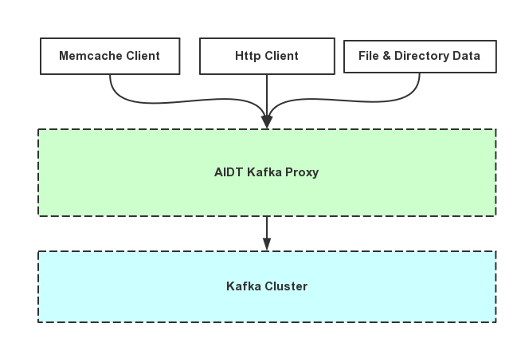

# aidt

AIDT (WEIBO AD DATA TRANSFER) 是数据传输到 Kakfa 的一个代理, 统称数据传输服务, 该服务可以支持多种方式将数据传输到 Kafka 中，分别是通过 Memcache 协议方式、Http 协议方式、实时监听文件目录方式, 用户可以根据自己的业务环境来灵活选择传输方式, 服务结构如图所示：



### 特性

 - 支持 Memcache 协议方式发送数据
 - 支持 Http 协议方式发送数据
 - 支持文件目录方式发送数据
 - 支持二进制安全传输
 - 服务自身监控数据

### Quick Start

#### 安装

目前提供 Linux 平台下主流版本的安装包 [下载](https://github.com/weiboad/aidt/releases), 安装步骤如下

```
wget https://github.com/weiboad/aidt/releases/download/v1.0.1/aidt-1.0.1-Linux-x86_64.tar.gz
tar -zxf aidt-1.0.1-Linux-x86_64.tar.gz
cd aidt-1.0.1-Linux-x86_64
./bin/aidt -v
```

#### 配置

在软件包中的 `conf` 目录下有两个配置文件，一个是 `system.ini` 是服务的主配置文件，`aidt.yml` 是服务使用监听文件目录方式传输数据的配置文件，如果不使用文件目录方式传输数据该文件使用默认配置即可，具体的 `aidt.yml` 配置方式参见[文件传输](docs/file_transfer.md), `system.ini` 各个配置项意义参考 [配置](docs/configure.md)

1. 修改kafka 集群的 broker list

```
// system.ini
brokerListIn=127.0.0.1:9192
``` 

2. 配置 Memcache 、Http Server 监听地址

```
[mc]
host=0.0.0.0
port=40011
threadNum=4
serverName=mc-server

[http]
host=0.0.0.0
port=40010
timeout=3
threadNum=4
serverName=adinf-adserver
accessLogDir=logs/
accesslogRollSize=52428800
defaultController=index
defaultAction=index
```

默认分别是 40011 和 40010

3. 配置服务日志目录

```
cd aidt-1.0.1-Linux-x86_64/bin
mkdir logs
```

4. 修改日志级别和写入方式

推荐生成环境下改为如下配置

```
[logging]
logsDir=logs/
; 日志分卷大小
logRollSize=52428800
; 1: LOG_TRACE 2: LOG_DEBUG 3: LOG_INFO
logLevel=3
isAsync=yes
```

#### 启动

```
cd aidt-1.0.1-Linux-x86_64/bin
./aidt -c ../conf/system.ini
```

#### 测试

##### 通过 Memcache 协议发送数据

使用 Memcache 协议的 set 命令发送数据，其中key 就是要发送数据的 topic 和分区，例如有一个 test 的topic 有 [0,1] 两个分区，可以使用 test#0 表示发送到 test topic 的 0号分区，使用 test 作为key 表示分区任意， value 是要发送的数据

例如：

```
[vagrant@localhost aidt]$ telnet 127.0.0.1 40011
Trying 127.0.0.1...
Connected to 127.0.0.1.
Escape character is '^]'.
version
VERSION 1.0.0
set test 1 1 4
data
STORED
set test#1 1 1 5
data1
STORED
quit
Connection closed by foreign host.
```

##### 通过 Http 协议发送数据

通过 http 方式发送数据参数 data 是要发送的数据

```
curl -d 'data=testmessage' '127.0.0.1:40010/message?topic_name=test'
{"code":0,"baseid":804904302018560,"data":"","msg":"Message send success"}
```

##### 通过文件目录方式

参见[文件目录传输](docs/file_transfer.md)
